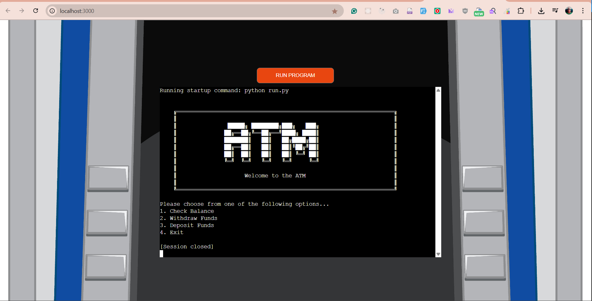
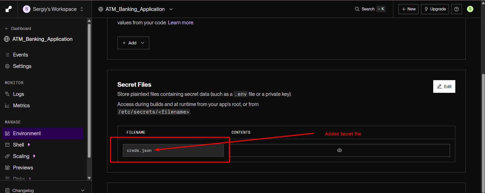
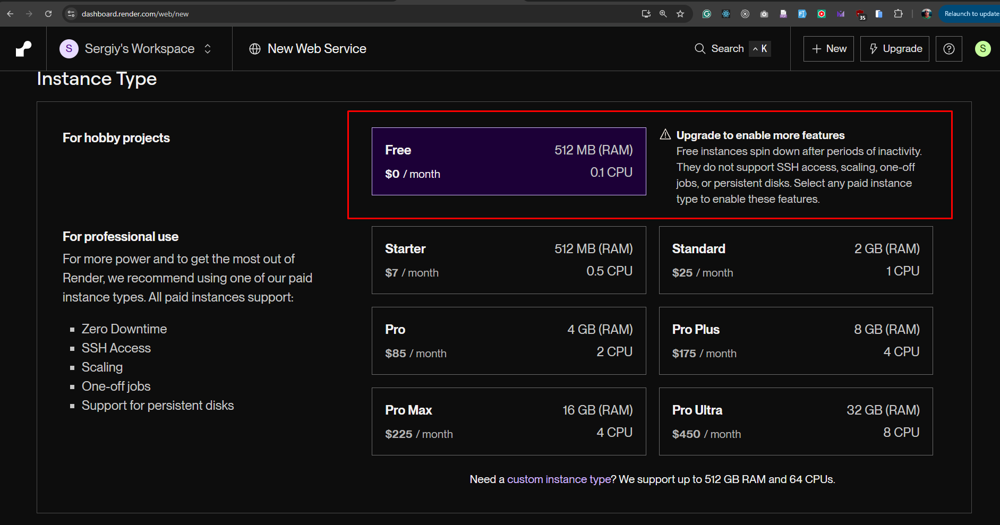

# ATM Banking Application - Python

A web-based ATM banking simulation application built with Python and Node.js, featuring real-time terminal interaction through WebSocket connections.

## Live Demo
- **Production Site**: https://atm-banking-application.onrender.com/
- **Responsive Preview**: https://ui.dev/amiresponsive?url=https%3A%2F%2Fatm-banking-application.onrender.com%2F


## Table of Contents
- [ATM Banking Application - Python](#atm-banking-application---python)
  - [Live Demo](#live-demo)
  - [Table of Contents](#table-of-contents)
  - [Overview](#overview)
    - [Features](#features)
    - [Tech Stack](#tech-stack)
  - [ATM System Architecture](#atm-system-architecture)
    - [Understanding ATM Hardware](#understanding-atm-hardware)
    - [Software Components](#software-components)
    - [State Management](#state-management)
  - [Web Interface Architecture](#web-interface-architecture)
    - [Controller Layer](#controller-layer)
    - [Views Layer](#views-layer)
    - [File Structure](#file-structure)
  - [Installation & Setup](#installation--setup)
    - [Prerequisites](#prerequisites)
    - [Local Development](#local-development)
    - [Google Sheets Integration](#google-sheets-integration)
  - [Deployment](#deployment)
    - [Render Free Plan Setup](#render-free-plan-setup)
  - [Usage](#usage)
  - [Testing](#testing)
    - [Unit Testing](#unit-testing)
    - [Integration Testing](#integration-testing)
  - [Troubleshooting](#troubleshooting)
  - [Security](#security)
  - [Contributing](#contributing)

## Overview

This application simulates a real ATM banking system with a web-based terminal interface. It provides core banking functionalities including account authentication, balance checking, deposits, withdrawals, and transaction history.

### Features
- 🏧 **ATM Simulation**: Complete ATM workflow simulation
- 🔐 **Authentication**: Secure card number and PIN verification
- 💰 **Banking Operations**: Deposit, withdrawal, balance inquiry
- 📊 **Google Sheets Integration**: Real-time data storage and retrieval
- 🌐 **Web Terminal**: Browser-based terminal interface using xterm.js
- 🔄 **Real-time Updates**: WebSocket-powered live communication
- 📱 **Responsive Design**: Works on desktop, tablet, and mobile devices
- 🛡️ **Security**: Encrypted credentials and secure data handling

### Tech Stack
- **Backend**: Python 3.x, Node.js with Total.js framework
- **Frontend**: HTML5, CSS3, JavaScript, xterm.js
- **Database**: Google Sheets API
- **Communication**: WebSocket for real-time terminal interaction
- **Deployment**: Render.com with automatic builds

## ATM System Architecture

### Understanding ATM Hardware

An ATM (Automated Teller Machine) consists of several key components:

#### Hardware Components
- **Card Reader**: Reads magnetic stripe or chip cards
- **PIN Pad**: Secure keypad for PIN entry and amount input
- **Display Screen**: Shows user interface (32x16 character grid traditionally)
- **Function Keys**: Side buttons (4+4) or touchscreen for menu navigation
- **Cash Dispenser**: Mechanical unit for dispensing banknotes
- **Receipt Printer**: Prints transaction receipts
- **Security Sensors**: Various sensors for tamper detection

#### Software Standards
The industry uses the **CEN/XFS** (eXtension For Financial Services) standard, which provides:
- Unified hardware abstraction layer
- Device driver standardization
- Client-server architecture with XFS Manager API

### Software Components

#### Banking Application Layer
The user-facing application that:
- Collects customer input
- Validates credentials
- Processes transactions
- Communicates with host systems
- Manages user interface flow

#### Communication Protocols
- **NDC/DDC**: Industry protocols for host communication
- **ISO 8583**: Message format for financial transactions
- **TLS/SSL**: Encrypted communication channels

### State Management

ATMs operate in different modes:
- **Power Up**: System initialization
- **Offline**: No server connection
- **Supervisor**: Service/maintenance mode
- **Out of Service**: Non-operational
- **In Service**: Normal operation mode

Each operational state (001-999) defines:
```
000 A001001011008004002001104
```
- `000`: State number
- `A`: State type (A=Card read, B=PIN entry, etc.)
- `001`: Screen number to display
- `001`: Success transition state
- `011`: Error transition state
- Additional parameters for specific operations

## Web Interface Architecture



### Controller Layer

**File**: `controllers/default.js`

Manages web interface and terminal integration with these key components:

#### WebSocket Connection
- Real-time bidirectional communication
- Handles multiple concurrent sessions
- Automatic connection recovery

#### Child Process Management
```javascript
// Spawns Python process with UTF-8 encoding
python = spawn('python', ['-u', 'run.py'], {
    env: { ...process.env, PYTHONIOENCODING: 'utf-8' }
});
```

#### Features
- **Process Isolation**: Each connection gets its own Python instance
- **Real-time I/O**: Live stdout/stderr forwarding
- **Input Handling**: Browser keystrokes sent to Python stdin
- **Auto Cleanup**: Process termination on disconnect

### Views Layer

**Files**: `views/layout.html`, `views/index.html`

#### Layout Components
- **Base Template**: Common HTML structure and styling
- **xterm.js Integration**: Terminal emulator from CDN
- **Responsive Design**: Mobile-friendly interface

#### Terminal Features
- **Local Echo**: Immediate keystroke feedback
- **Line Editing**: Backspace support and input buffering
- **Enter Handling**: Sends complete lines to Python application

### File Structure
```
├── controllers/
│   └── default.js          # WebSocket + Python bridge
├── views/
│   ├── layout.html         # Base layout + xterm setup
│   └── index.html          # Terminal UI + WebSocket client
├── img/                    # Documentation images
├── run.py                  # Main Python ATM application
├── index.js                # Total.js server entry point
├── package.json            # Node.js dependencies
├── requirements.txt        # Python dependencies
├── render.yaml             # Render deployment config
├── apt.txt                 # System packages for Render
└── README.md               # This documentation
```

## Installation & Setup

### Prerequisites
- **Node.js**: Version 20.x or higher
- **Python**: Version 3.8 or higher
- **Git**: For version control
- **Google Account**: For Sheets API (optional)

### Local Development

1. **Clone the repository**:
```bash
git clone <your-repo-url>
cd ATM_Banking_Application
```

2. **Install Node.js dependencies**:
```bash
npm install
```

3. **Install Python dependencies**:
```bash
pip install -r requirements.txt
```

4. **Start the development server**:
```bash
npm start
```

5. **Access the application**:
   - Open http://localhost:3000
   - Click "Run Program"
   - Follow the ATM prompts

### Google Sheets Integration

1. **Create Google Service Account**:
   - Go to [Google Cloud Console](https://console.cloud.google.com/)
   - Create new project or select existing
   - Enable Google Sheets API
   - Create service account and download JSON key

2. **Setup Spreadsheet**:
   ```
   Spreadsheet Name: client_database
   Worksheet Name: client
   Headers: cardNum | pin | firstName | lastName | balance
   ```

3. **Share with Service Account**:
   - Share your spreadsheet with the service account email
   - Grant "Editor" permissions

4. **Configure Credentials** (Choose one method):
   
   **Method A: Environment Variable (Recommended)**
   ```bash
   export CREDS='{"type":"service_account","project_id":"..."}'
   ```
   
   **Method B: Local File**
   ```bash
   # Place your service account JSON as creds.json in project root
   cp path/to/your/service-account.json creds.json
   ```

## Deployment

### Render Free Plan Setup

1. **Prepare Repository**:
   - Ensure all files are committed to Git
   - Push to GitHub/GitLab

2. **Create Render Service**:
   - Visit [Render.com](https://render.com)
   - Click "New" → "Web Service"
   - Connect your repository

3. **Configure Service**:
   ```
   Name: atm-banking-application
   Branch: main
   Runtime: Node
   Build Command: npm install && pip install -r requirements.txt
   Start Command: npm start
   ```

4. **Set Environment Variables**:
   ```
   GOOGLE_APPLICATION_CREDENTIALS=/etc/secrets/creds.json
   ```

5. **Add Secret Files**:
   - File Name: `creds.json`
   - Content: Your complete Google service account JSON
   - Path: `/etc/secrets/creds.json`



6. **Select Instance Type**:
   - Choose "Free" for development/testing
   - Note: Free tier has 512MB RAM limit and cold starts



7. **Deploy**:
   - Click "Create Web Service"
   - Wait for build completion
   - Test your deployed application

## Usage

1. **Access the Terminal**:
   - Navigate to your deployed URL or localhost:3000
   - Click "Run Program" button

2. **ATM Workflow**:
   ```
   Insert Your Card: [Enter card number]
   Enter PIN: [Enter PIN code]
   Main Menu:
   1. Check Balance
   2. Deposit Money
   3. Withdraw Money
   4. View Transaction History
   5. Exit
   ```

3. **Sample Test Data** (for development):
   ```
   Card: 1234567890123456
   PIN: 1234
   ```

## Testing

### Unit Testing

Create comprehensive unit tests for core functionality:

```python
# unittest.py
import unittest
import sys
import os

# Add project root to path
sys.path.insert(0, os.path.dirname(os.path.abspath(__file__)))

class TestATMFunctionality(unittest.TestCase):
    def setUp(self):
        """Set up test fixtures before each test method."""
        pass
    
    def test_card_validation(self):
        """Test card number validation."""
        pass
    
    def test_pin_verification(self):
        """Test PIN verification logic."""
        pass
    
    def test_balance_inquiry(self):
        """Test balance checking functionality."""
        pass
    
    def test_withdrawal_limits(self):
        """Test withdrawal amount validation."""
        pass
    
    def test_deposit_validation(self):
        """Test deposit amount validation."""
        pass

if __name__ == '__main__':
    unittest.main()
```

**Run tests**:
```bash
python unittest.py
```

### Integration Testing

Test the complete workflow:

1. **Web Interface Testing**:
   - Terminal connection establishment
   - WebSocket communication
   - User input handling

2. **Google Sheets Integration**:
   - Authentication verification
   - Data retrieval accuracy
   - Update operations

3. **End-to-End Testing**:
   - Complete ATM transaction flows
   - Error handling scenarios
   - Session management

## Troubleshooting

### Common Issues

**Card Not Found**:
- ✅ Verify spreadsheet name: `client_database`
- ✅ Check worksheet name: `client`
- ✅ Ensure headers: `cardNum | pin | firstName | lastName | balance`
- ✅ Share sheet with service account email
- ✅ Check Google Cloud Console for API quotas

**Authentication Errors**:
- ✅ Verify service account JSON format
- ✅ Check file permissions on creds.json
- ✅ Ensure Google Sheets API is enabled
- ✅ Validate environment variable setup

**Terminal Issues**:
- ✅ Click inside terminal area to focus
- ✅ Press Enter to submit input lines
- ✅ Clear browser cache if display issues occur
- ✅ Check browser console for JavaScript errors

**Render Deployment Issues**:
- ✅ Verify Node.js version in package.json
- ✅ Check build logs for errors
- ✅ Ensure all dependencies are listed
- ✅ Validate secret file configuration

**Performance Issues (Free Tier)**:
- ✅ Cold starts can take 30-60 seconds
- ✅ Service sleeps after 15 minutes of inactivity
- ✅ Memory limit: 512MB (monitor usage)

### Getting Help

If you encounter issues:

1. Check the Render logs:
   ```bash
   # View recent logs
   render logs --tail=100
   ```

2. Test locally first:
   ```bash
   npm start
   ```

3. Verify Google Sheets manually:
   - Open your spreadsheet
   - Check data format
   - Verify sharing permissions

## Security

### Best Practices

- 🔐 **Never commit credentials**: Use `.gitignore` for sensitive files
- 🔑 **Use environment variables**: Store secrets securely
- 🛡️ **Rotate keys regularly**: Update service account keys periodically
- 🔒 **Limit permissions**: Grant minimum required access
- 🚫 **Validate inputs**: Sanitize all user inputs
- 🔍 **Monitor access**: Review Google Cloud audit logs

### Security Features

- **Encrypted communication**: All data transmitted over HTTPS/WSS
- **Process isolation**: Each session runs in separate Python process
- **Credential management**: Secure handling of authentication tokens
- **Input validation**: Protection against injection attacks

## Contributing

We welcome contributions! Please follow these guidelines:

1. **Fork the repository**
2. **Create a feature branch**: `git checkout -b feature/amazing-feature`
3. **Commit changes**: `git commit -m 'Add amazing feature'`
4. **Push to branch**: `git push origin feature/amazing-feature`
5. **Open a Pull Request**

### Development Guidelines

- Follow PEP 8 for Python code
- Use ESLint for JavaScript code
- Write tests for new features
- Update documentation for changes
- Test both locally and on Render

---

**Note**: This application is for educational purposes and demonstrates ATM system concepts. For production banking applications, additional security measures, compliance requirements, and regulatory approvals would be necessary.
